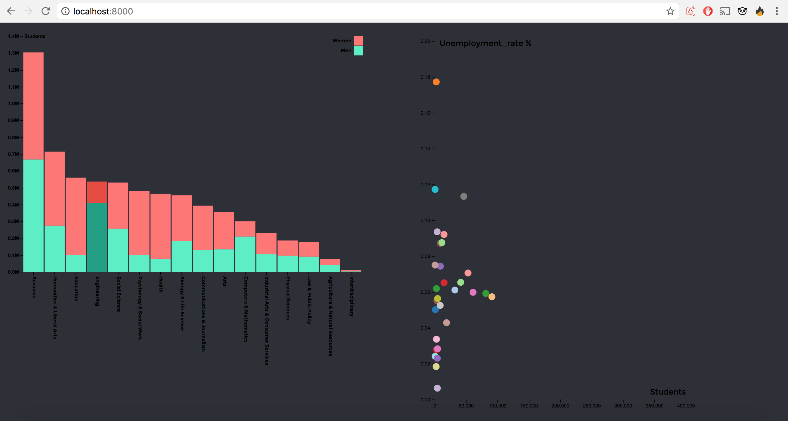

# assessment 3

This is the final assessment of this course. In this assessment i will show that i can clean data, create a way to show data in more than one visualisation and make the visualisations interactive using enter, update and exit.

This visualisation is also used in assessment 2 to show that i can clean data. [link](https://github.com/JimmydeKroon/fe3-assessment-2)


As you can see in the image above the visualisation consists of one stacked bar chart and one scatterplot.
The stacked bar chart shows multiple majors categories and the amount of people studying, if you click on one of the bars the scatterplot will update and show the majors within those categories + the unemployment rate for that major.
This will make it easy to see wich majors are popular and wich majors have a high job guarantee. You can make the right choice by searching for a major with a low unemployment rate and low popularuty for example!

## Data
The data is taken from the fivethirtyeight github repository, it's called /college majors
[link to dataset](https://github.com/fivethirtyeight/data/tree/master/college-majors)

### What does the data tell?
This data has some interesting statistics about majors:
- the name of the major
- what category this major belongs to
- how many students this major has
- the amount of men and the amount of women
- the amount of people who are employed
- amount of part-time and full-time employed
- the amount of people who are unemployed
- the unemployment rate

& a lot more, but we won't be using all of the data

### So what data are we using?
In this assessment we'll be using the following data from the source:
- the major names
- the major_category
- the amount of men and women
- the total amount of students
- the unemployment rate

## Cleaning

All majors in this file have their own name and statistics (total of 173). To make this readable in a chart i need to categorize the majors into their own category. luckily all rows have a major_category, wich tells us what sector this major belongs to.

We are going to make a new dataobject that will store the data in categories instead of 173 single entries

```javascript
var dataTest = {};
```
we loop trough the .csv and check for "major_category", "men" and "women".
we check to see if the current major_category is already inside dataTest,
- if it is, we add .men .women and .total to that category in dataTest
- if it isn't, we first add the current major_category and then add .men .women and .total to that category

```javascript
d3.csv("data2.csv", function(d, i, columns) {
  var newColumns = ["Major_category", "Men", "Women"]
    for (i = 1, t = 0; i < newColumns.length; ++i){
      t += d[newColumns[i]] = +d[newColumns[i]];
    }
    if(d.Major_category in dataTest){
      dataTest[d.Major_category].Men += parseInt(d.Men);
      dataTest[d.Major_category].Women += parseInt(d.Women);
      dataTest[d.Major_category].total += parseInt(t);
    }else{
      dataTest[d.Major_category] = {};
      dataTest[d.Major_category].Men = parseInt(d.Men);
      dataTest[d.Major_category].Women = parseInt(d.Women);
      dataTest[d.Major_category].total = parseInt(t);
    }
};)
```

This code makes it so the data is categorized in their own major category, this means all engineering major data will be under "engineering" and all arts major data is under "arts" for example.

you can also see the parseInt before the data, i do this to so i get a number instead of a string as return.

In order to make the rectangles in the stacked bar chart clickable i need to give each bar a class with the name of the major. This way i can check wich major is selected.

```javascript
.enter().append("rect")
  .attr("x", function(d) { return x(d.data.Major); })
  .attr("y", function(d) { return y(d[1]); })
  .attr("height", function(d) {return y(d[0]) - y(d[1]); })
  .attr("width", x.bandwidth())

  .attr("class", function(d) { return d.data.Major.replace(/[^A-Z0-9]/ig, ""); })
```

d.data.major will be the name of the class, but some of the majors have spaces in their names. A class can't have a space in it so i use .replace to only allow characters from A to Z and 0 to 9, the spaces will be removed.

```javascript
var keys = data.newColumns.slice(1);
```

make it so var keys holds "men" and "women", the first item in newColumns holds something we don't need.
var keys will be used to make the legend.

## interesting bits of code

Some of the code in this script is special and makes up a big portion of how the visualisation works.
So we will be skipping parts like these, wich is code that came with the chart from d3js.org:

```javascript
g.append("g")
    .attr("class", "axis")
    .attr("transform", "translate(0," + barHeight + ")")
    .call(d3.axisBottom(x))
  .selectAll("text")
    .attr("y", 0)
    .attr("x", 9)
    .attr("dy", ".2em")
    .attr("transform", "rotate(90)")
    .attr("font-family", "Montserrat", "sans-serif")
    .attr("font-weight", "bold")
    .style("text-anchor", "start");
```
These bits of code draw the axes, rectangles, bubbles, labels and more based on the data from the csv

Some of the interesting code is already mentioned in the section above (cleaning), a big part of the visualisation relies in the part that makes all of the data from the majors categorized. This way the stacked bar chart is readable and gives us something to click on to make the scatterplot update.

### enter, update, exit

The update cycle of this visualisation begins with a click on a rectangle in the stacked bar chart (any major category like business).

```javascript
.enter().append("rect")
  .attr("x", function(d) { return x(d.data.Major); })
  .attr("y", function(d) { return y(d[1]); })
  .attr("height", function(d) {return y(d[0]) - y(d[1]); })
  .attr("width", x.bandwidth())
```

We give each bar a class, the name comes from d.data.major.
```javascript  
  .attr("class", function(d) { return d.data.Major.replace(/[^A-Z0-9]/ig, ""); })
```

When the bar is clicked we call a function named updateScatter (this is inside updateScatter.js) and give it the data from the major category we clicked. scroll down a bit to see what happens in the updateScatter function.

After the function call we change the color of the selected bar in the stacked bar chart to show the highlighted category, we also set the last selected bar back to it's original color.
```javascript
  .on("click",function(d){
      updateScatter(d.data.Major)

      // set the last selected bar back to the orignal color
      lastSelected._groups[0][0].setAttribute("fill", "#55efc4")
      lastSelected._groups[0][1].setAttribute("fill", "#ff7675")

      // highlight the new color
      var elements = d3.selectAll("."+d.data.Major.replace(/[^A-Z0-9]/ig, ""))
      elements._groups[0][0].setAttribute("fill", "#16a085")
      elements._groups[0][1].setAttribute("fill", "#e74c3c")

      // save wich bar was selected last
      lastSelected = elements;
  });
```


The function updateScatter is inside it's own js file, updateScatter.js
First we take the global variable dataset (wich houses data about the current selected major category) and put it in data
```javascript
function updateScatter(major){
  var data = dataset[major];}
```

We take all bubbles (dots on scatterplot) and make their data the new data from dataset[major]
```javascript
  var bubble = scatterSvg.selectAll('.bubble')
    .data(data);
```

Remove the dots that aren't needed
```javascript
    bubble.exit().remove();
```

Add new dots if needed and give the dots their new data to determine position etc.
```javascript
    bubble.enter().append("circle")
    .attr('class', 'bubble')
    .attr('cx', function(d){return xScale(d.Total);})
    .attr('cy', function(d){ return yScale(d.Unemployment_rate); })
    .attr('r', function(d){ return radius(1) + 5; })
    .style('fill', function(d){ return color(d.Major); });
```

Animate the dots to their new position
```javascript
   bubble.transition()
       .duration(750)
       .ease(d3.easeQuadOut)
       .attr('class', 'bubble')
       .attr('cx', function(d){return xScale(d.Total);})
       .attr('cy', function(d){ return yScale(d.Unemployment_rate); })
       .attr('r', function(d){ return radius(1) + 5; })
       .style('fill', function(d){ return color(d.Major); });
```

Give all dots a new label (shows the name of the major on hover)
```javascript
       var bubble = scatterSvg.selectAll('.bubble')
        .append('title')
         .attr('x', function(d){ return radius(1); })
         .text(function(d){
           return d.Major;
         });
}
```

And that is how this visualisation enters, updates and exits!

## thoughts
This was a very tricky assignment for me since im not that naturally skilled with javascript to begin with. Adding in D3 made things pretty difficult. Once the data was categorized and i was able to complete the stacked bar chart things started going a bit faster, i had a better view of the project and i could see what was needed to finish the visualisation. Major credit to some of the warriors on stackoverflow.com for providing me with loads of small solutions and ways to start solving problems.

## features
* [D3](https://d3js.org/)
* [Data](https://github.com/fivethirtyeight/data/tree/master/college-majors)
* [Author](https://b.locks.org/mbostock)
* [Original stacked barchart](https://bl.ocks.org/mbostock/3886208)
* [D3 scaleBand](https://github.com/d3/d3-scale/blob/master/README.md#scaleBand)
* [D3 csv](https://github.com/d3/d3/wiki/CSV)
* [D3 map](https://github.com/d3/d3-collection/blob/master/README.md#map)
* [D3 transition](https://github.com/d3/d3-transition/blob/master/README.md#transition)
* [D3 select](https://github.com/d3/d3-selection/blob/master/README.md#select)
* [D3 selectAll](https://github.com/d3/d3-selection/blob/master/README.md#selectAll)
* [Selection append](https://github.com/d3/d3-selection/blob/master/README.md#selection_append)
* [Selection attr](https://github.com/d3/d3-selection/blob/master/README.md#selection_attr)
* [Selection enter](https://github.com/d3/d3-selection/blob/master/README.md#selection_enter)

## License
GPL 3.0 © 2017 Jimmy de Kroon
